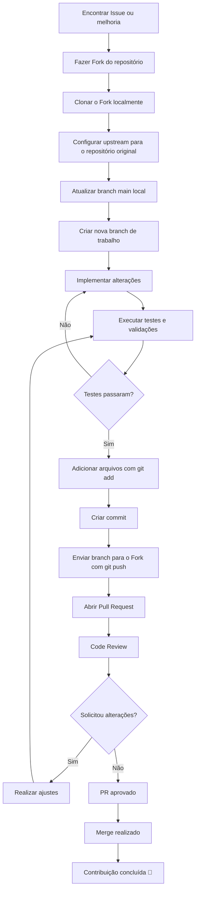
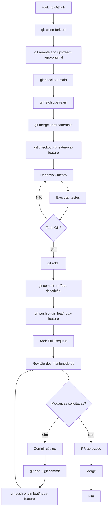

# Representação do processo completo de contribuição com diagrama Mermaid:

```mermaid
flowchart TD

    A[Encontrar Issue ou melhoria] --> B[Fazer Fork do repositório]

    B --> C[Clonar o Fork localmente]

    C --> D[Configurar upstream para o repositório original]

    D --> E[Atualizar branch main local]

    E --> F[Criar nova branch de trabalho]

    F --> G[Implementar alterações]

    G --> H[Executar testes e validações]

    H --> I{Testes passaram?}

    I -->|Não| G
    I -->|Sim| J[Adicionar arquivos com git add]

    J --> K[Criar commit]

    K --> L[Enviar branch para o Fork com git push]

    L --> M[Abrir Pull Request]

    M --> N[Code Review]

    N --> O{Solicitou alterações?}

    O -->|Sim| P[Realizar ajustes]

    P --> H

    O -->|Não| Q[PR aprovado]

    Q --> R[Merge realizado]

    R --> S[Contribuição concluída 🎉]
```

## Uma versão mais detalhada, incluindo os comandos Git principais:

```mermaid
flowchart TD

    A[Fork no GitHub] --> B["git clone fork-url"]

    B --> C["git remote add upstream repo-original"]

    C --> D["git checkout main"]

    D --> E["git fetch upstream"]

    E --> F["git merge upstream/main"]

    F --> G["git checkout -b feat/nova-feature"]

    G --> H[Desenvolvimento]

    H --> I[Executar testes]

    I --> J{Tudo OK?}

    J -->|Não| H

    J -->|Sim| K["git add ."]

    K --> L["git commit -m 'feat: descrição'"]

    L --> M["git push origin feat/nova-feature"]

    M --> N[Abrir Pull Request]

    N --> O[Revisão dos mantenedores]

    O --> P{Mudanças solicitadas?}

    P -->|Sim| Q[Corrigir código]

    Q --> R["git add + git commit"]

    R --> S["git push origin feat/nova-feature"]

    S --> O

    P -->|Não| T[PR aprovado]

    T --> U[Merge]

    U --> V[Fim]
```
